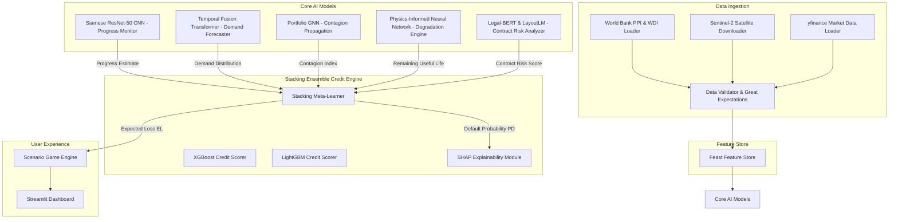

# InfraRisk AI: Multi-Modal Infrastructure Credit Risk Quantification Platform

[](https://github.com/ZethetaIntern/infrarisk-ai/actions)
[](#)
[](#)
[](#)

InfraRisk AI is an advanced, production-grade, multi-modal risk quantification and credit decisioning platform for cross-border infrastructure project finance. By fusing geospatial computer vision, time-series forecasting, graph-based contagion models, physical degradation physics engines, and legal NLP contract intelligence, the platform enables credit officers to perform high-fidelity quantitative risk profiling.

The system is packaged with a turn-based **gamified simulation cockpit** (InfraRisk Lab) that allows analysts to manage capital reserves, stress-test assets under extreme macroeconomic/geological shocks, and evaluate risk mitigation strategies.

---

## 🚀 Multi-Modal AI Architecture

The platform aggregates diverse data sources into a unified credit risk and expected loss calculation:



### 🧠 Module Breakdown
1. **Geospatial Pipeline (`src/models/cnn`)**: Siamese ResNet-50 CNN extracts construction progress and delay anomalies from Sentinel-2 cloud-free 13-band multispectral GeoTIFFs using NDVI/NDBI indices.
2. **Demand Forecasting (`src/models/tft`)**: Temporal Fusion Transformer (TFT) with quantile regression yields probabilistic demand intervals (P10/P50/P90), outperforming standard baseline SARIMA models.
3. **Physical Degradation (`src/models/pinn`)**: Physics-Informed Neural Networks (PINN) model long-term structural wear (Paris law crack growth, AASHTO pavement decay, corrosion depth) to project Remaining Useful Life (RUL).
4. **Contract Analytics (`src/models/nlp`)**: Fine-tuned Legal-BERT classifies clauses and extracts metadata from financial loan documents to identify legal risk exposures.
5. **Credit Scoring Ensemble (`src/models/xgb` & `ensemble`)**: Combines cross-domain features into an XGBoost/LightGBM stacking ensemble meta-learner, predicting calibrated Probabilities of Default (PD) explained via SHAP.
6. **Portfolio Network (`src/models/gnn`)**: PyTorch Geometric GNN models physical and financial dependencies across cross-border assets, propagating default contagion under shock events.

---

## 📂 Repository Directory Structure

```
infrarisk-ai/
├── src/
│   ├── data/           # World Bank, Sentinel-2, yfinance loaders & Great Expectations validator
│   ├── features/       # Feature extraction (financial, satellite, macro, fusion, NLP)
│   ├── models/
│   │   ├── cnn/        # Siamese CNN progress estimator
│   │   ├── tft/        # Temporal Fusion Transformer & SARIMA baseline
│   │   ├── gnn/        # GNN contagion propagation
│   │   ├── pinn/       # PINN physical decay models
│   │   ├── nlp/        # Legal-BERT contract parser
│   │   ├── xgb/        # XGBoost & LightGBM credit scorers
│   │   └── ensemble/   # Stacking meta-learner
│   ├── simulation/     # Gamified turn-based simulation engine
│   └── dashboard/      # Streamlit dashboard app
├── data/               # Project data directory (DVC-tracked)
├── notebooks/          # EDA and visualization notebooks
├── tests/              # Unit and integration tests (pytest-cov)
├── configs/            # Pipeline configurations
├── docker/             # Dockerfile and docker-compose.yml
├── docs/               # Sphinx documentation, conf.py, index.rst & Credit Committee Memos
├── requirements.txt    # Pinned Python package dependencies
├── setup.py            # Package installation configuration
└── README.md           # This project overview and setup guide
```

---

## ⚙️ Setup & Installation

### Prerequisite System Dependencies
Because the platform relies on geospatial and advanced scientific libraries, you must install the following C-libraries on your host system:
* **Windows**: Install the build tools for Visual Studio, GDAL binaries, and PROJ.
* **Linux/Ubuntu**:
  ```bash
  sudo apt-get update && sudo apt-get install -y build-essential libgdal-dev libproj-dev
  ```

### Virtual Environment Setup
1. Clone the repository and navigate to its root folder.
2. Initialize and activate a Python virtual environment:
   ```bash
   python -m venv .venv
   # Windows:
   .venv\Scripts\activate
   # Linux/macOS:
   source .venv/bin/activate
   ```
3. Install pinned dependencies and the local package:
   ```bash
   pip install --upgrade pip
   pip install -r requirements.txt
   pip install -e .
   ```

### Running Tests
Execute unit and integration tests with coverage reporting. The project maintains a strict quality gate:
```bash
pytest --cov=src --cov-report=term-missing --cov-fail-under=60
```

---

## 🎮 Gamified Simulation Rules & Mechanics

The dashboard includes the **InfraRisk Lab Cockpit**, a turn-based simulation spanning a **5-year (20-quarter) investment campaign**. 

### Game Rules
* **Objective**: Protect a **USD 100 Million capital reserve** and maintain high credit quality while navigating random macroeconomic, geological, and climate shocks.
* **Asset Allocation**: Lenders manage a portfolio of 5 cross-border African projects:
  * `PRJ-01`: Toll Road (Nairobi-Mombasa Corridor, Kenya)
  * `PRJ-02`: Hydropower Station (Song Loulou, Cameroon)
  * `PRJ-03`: Commercial Port (Alexandria Terminal, Egypt)
  * `PRJ-04`: Solar Farm (Kampala Solar, Uganda)
  * `PRJ-05`: Road Network (Lagos Urban Arterial, Nigeria)
* **Turn Sequence**:
  1. Review quarterly risk disclosures and active shock events (e.g., currency collapse, regional droughts).
  2. Purchase quarterly **risk mitigations** using cash reserves.
  3. Click **"Advance Quarter"** to process the next step's stochastic shocks, recalculate credit scores, and deduct capital losses from defaults.

### Risk Mitigation Menu
| Decision | Cost (per asset/quarter) | Covered Risk |
| :--- | :--- | :--- |
| **Interest Rate Swap (IRS)** | USD 1.5 Million | Shields asset against interest rate hikes (SOFR volatility) |
| **Currency Hedge (FX)** | USD 2.0 Million | Prevents DSCR depletion from local currency depreciation |
| **Credit Default Swap (CDS)** | USD 2.5 Million | Insures 90% of expected loss during default events |
| **Physical Maintenance** | USD 3.0 Million | Restores structural health (PINN-modeled PSI / corrosion) |

### Game Over Conditions
1. **Insolvency**: Capital Reserves drop below USD 0.
2. **Regulatory Shutdown**: Portfolio Credit Risk Rating collapses (Rating Score < 15/100).
3. **Successful Completion**: Survive all 20 quarters with capital above 0.

---

## 📊 MLOps & Monitoring Configurations

### 1. MLflow Tracking Server
All training metrics, hyperparameters, and models are tracked in MLflow.
* Start the MLflow tracking server locally:
  ```bash
  mlflow server --host 0.0.0.0 --port 5000 --backend-store-uri sqlite:///mlflow.db --default-artifact-root ./mlruns
  ```
* Access the UI at [http://localhost:5000](http://localhost:5000).

### 2. Feast Feature Store
Features are versioned and served through Feast.
* Initialize the local registry:
  ```bash
  feast init feature_repository
  cd feature_repository
  # Edit feature_store.yaml to register local data
  feast apply
  ```

### 3. Great Expectations Data Validation
Data pipelines run validation checks before training models.
* Run validation suites:
  ```bash
  great_expectations checkpoint run projects_data_checkpoint
  ```

---

## 🐳 Containerized Deployment (Docker Compose)

Deploy the entire stack—Streamlit dashboard, MLflow server, and Feast feature server—with a single command:

```bash
docker-compose -f docker/docker-compose.yml up --build
```

### Exposed Services
* **Streamlit Dashboard**: [http://localhost:8501](http://localhost:8501)
* **MLflow Tracking UI**: [http://localhost:5000](http://localhost:5000)
* **Feast Feature Server**: [http://localhost:6566](http://localhost:6566)
