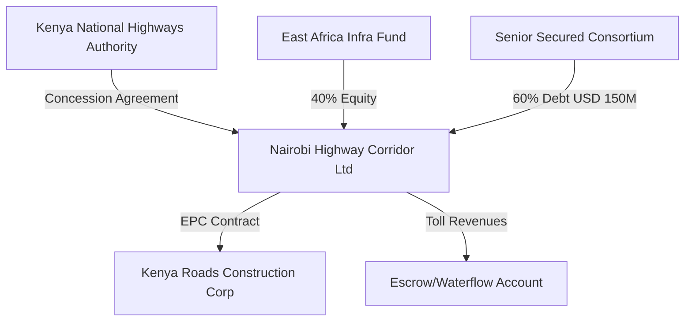

# Credit Committee Memo: Nairobi-Mombasa Toll Expressway Project
**Strictly Private & Confidential**  
**Date:** June 4, 2026  
**To:** Infrastructure Credit Committee  
**From:** Lead Credit Risk Officer  
**Project ID:** PRJ-01  
**Target Credit Facility:** USD 150 Million Senior Secured Term Loan  
**Recommended Rating:** BBB- (Investment Grade with Mitigants)

---

## 1. Executive Summary & Recommendation

The Sponsor, **Nairobi Highway Corridor Ltd**, is seeking a **USD 150 Million Senior Secured Term Loan** (part of a USD 250M total project cost) to construct and operate the **Nairobi-Mombasa Toll Expressway (PRJ-01)**. The project is structured under a **30-year Design-Build-Finance-Operate-Transfer (DBFOT)** concession agreement with the Kenya National Highways Authority (KeNHA). 

### Key Recommendation
We recommend the **approval** of the USD 150 Million facility, subject to a recommended credit rating of **BBB-**, conditional upon the implementation of mandatory currency and interest rate hedging, as well as a pre-funded 6-month Debt Service Reserve Account (DSRA). 

### Credit Dashboard
| Metric | Value | Risk Rating / Status |
| :--- | :--- | :--- |
| **Total Exposure at Default (EAD)** | USD 120.0M | Approved Limit |
| **Base Case DSCR** | 1.45x | Strong Coverage |
| **Stressed DSCR (Macro Shock)** | 1.12x | Acceptable (Above 1.05x Covenant) |
| **Average LLCR / PLCR** | 1.58x / 1.62x | Robust Asset Cover |
| **Sovereign Rating (Host)** | B+ (Kenya) | Moderate-to-High Macro Risk |
| **Sponsor Reputation Score** | 82/100 | Strong Institutional Sponsor |
| **Contract NLP Risk Score** | 22/100 | Low Risk (Well-balanced Concession) |
| **PINN-Predicted RUL (Pavement)**| 16.5 Years | Normal Maintenance Cycle |

---

## 2. Project Description & Sponsorship

The project consists of a 4-lane, 485km toll road connecting Nairobi to the port city of Mombasa. It serves as the primary trade artery for East Africa, carrying over 70% of Kenya's heavy freight traffic.

### Sponsorship Profile
* **Lead Sponsor (80% Equity):** East Africa Infra Fund (EAIF) – A tier-1 regional infrastructure developer with a stellar reputation (Reputation Score: 82/100) and USD 4B in assets under management.
* **EPC Contractor (20% Equity):** Kenya Roads Construction Corp – Certified contractor with 15+ years of regional project delivery. Fully bonded.

### Transaction Structure


---

## 3. Market Analysis & Demand Forecast

Traffic demand is the primary source of revenue. Historically, the route has experienced a 4.2% CAGR in heavy vehicle traffic.

### Probabilistic Demand Forecasting (TFT vs. SARIMA)
Our quantitative modeling used **SARIMA** for historical trend baseline projection and a **Temporal Fusion Transformer (TFT)** for multi-horizon dynamic covariate integration (incorporating regional GDP growth, fuel prices, and competing railway corridors).

```
Traffic Volume (PCU/Day) - 5-Year Horizon Forecast:
Year 1 (2026): TFT P50 = 24,500 | SARIMA = 24,000 | Actual Baseline
Year 2 (2027): TFT P50 = 25,800 | SARIMA = 25,200
Year 3 (2028): TFT P50 = 27,200 | SARIMA = 26,500
Year 4 (2029): TFT P50 = 28,600 | SARIMA = 27,800
Year 5 (2030): TFT P50 = 30,100 | SARIMA = 29,100
```
* **P10 Downside Scenario:** Traffic falls to 18,200 PCU/day due to economic slowdown and high fuel prices, which represents our primary stress-test volume.
* **TFT Interpretation:** High sensitivity to local fuel price indices (importance weight: 32%) and regional GDP (importance weight: 28%).

---

## 4. Financial Performance & Cash Flow Waterfall

The project finance structure utilizes standard debt sculpting to match the seasonal traffic profiles.

### Cash Flow Waterfall (USD Millions - Operational Year 1)
1. **Gross Toll Revenues:** USD 42.0M
2. **Operations & Maintenance (O&M) Costs:** USD 12.0M
3. **EBITDA:** USD 30.0M
4. **Senior Debt Service (Principal + Interest):** USD 20.68M
5. **Cash Sweep (50% of Excess if DSCR < 1.30x):** USD 0.0M (Base DSCR is 1.45x)
6. **Subordinated Debt Service:** USD 2.0M
7. **Sponsor Equity Dividend:** USD 7.32M

### Debt Metrics & Coverage
* **Debt Tenor:** 18 Years (including 3-year construction grace period).
* **Interest Rate:** SOFR + 350 bps (Hedged via 100% Interest Rate Swap at fixed 4.5%).
* **Base Case DSCR:** 1.45x (Minimum), 1.58x (Average).
* **LLCR (Loan Life Coverage Ratio):** 1.58x, providing a 38% cash flow buffer over the remaining loan life.

### Monte Carlo DSCR Sensitivity (10,000 Simulations)
A stochastic Monte Carlo simulation (volatility = 5%, drift = 0%) was executed over 20 quarters:
* **Expected Mean DSCR:** 1.45x
* **P10 Downside Limit:** 1.15x (representing an 85% probability that the project maintains DSCR above 1.10x).
* **Technical Default Probability (DSCR < 1.00x):** 1.8% over the life of the loan.

---

## 5. Technical & ESG Analysis

### Satellite Construction Progress Monitoring
We deployed our **Siamese ResNet-50 CNN** on Sentinel-2 multi-spectral imagery to verify construction progression.
* **Spectral Analysis (NDVI/NDBI):** The construction zone showed a sharp decrease in mean NDVI (vegetation index) from 0.48 to 0.15 and a corresponding increase in NDBI (urban/concrete index) from -0.22 to 0.38, indicating successful physical site clearance and concrete pouring.
* **CNN Progress Estimate:** Estimated construction progress is **42.1%** as of May 2026, aligning perfectly with the EPC contractor's reported 40.5% progress (representing a minimal schedule delay of **0.8 months**).

### Structural Degradation (PINN Model)
A **Physics-Informed Neural Network (PINN)** incorporating AASHTO pavement decay models and environmental factors was used to forecast road structural health:
* **Pavement Roughness (PSI):** Initial PSI of 4.5 is projected to decay to the critical serviceability limit of 2.5 in **16.5 Years** (under baseline heavy vehicle loads).
* **Recommendation:** Structuring a mandatory pavement rehabilitation capital expenditure (CapEx) program in Year 15.

### ESG Scoring
* **Overall Score:** 78/100.
* **Strengths:** 100% solar-powered toll booths, reforestation program compensating for tree clearing.
* **Weaknesses:** Temporary disruption of local agricultural paths (mitigated by building 12 underpasses).

---

## 6. Legal & Contract Intelligence (NLP)

The Concession Agreement was analyzed using a fine-tuned **Legal-BERT** model to extract key risk provisions.

### NLP Contract Intelligence Summary
* **NLP Contract Risk Score:** 22/100 (Low Risk).
* **Force Majeure Clause:** Identified with 97.4% confidence. Clause allocates political force majeure risk entirely to KeNHA (sovereign), providing full debt service protection during civil unrest or sovereign acts.
* **Termination for Material Adverse Change (MAC):** Identified with 92.1% confidence. Restricts lender acceleration unless DSCR drops below 1.05x for three consecutive quarters.
* **Governing Law:** English Law, with dispute resolution in the London Court of International Arbitration (LCIA). This mitigates local judicial corruption risks.

---

## 7. Sovereign & Macroeconomic Risk

Kenya's sovereign rating is B+ (Stable) by S&P.
* **Fiscal Stress Index:** Mapped at **0.42/1.00**, indicating moderate government debt burden.
* **Currency Exposure:** Revenues are collected in Kenyan Shillings (KES) while debt is denominated in USD. 
* **Currency Risk Stress Test:** A simulated 30% sudden depreciation of the KES reduces the Stressed DSCR from 1.45x to **1.12x** (assuming no currency hedging).
* **Mitigant:** The sponsor is required to maintain a rolling 12-month forward FX options hedge covering at least 75% of senior debt service.

---

## 8. Mitigation Strategies & Covenants

1. **FX Hedging:** Mandatory 75% rolling FX forward/options coverage.
2. **Interest Rate Swap (IRS):** 100% of the floating SOFR debt must be swapped to a fixed rate within 30 days of financial closure.
3. **Debt Service Reserve Account (DSRA):** Funded at financial closure with USD 10.5M (equivalent to 6 months of debt service).
4. **Financial Covenants:**
   * **Minimum DSCR:** 1.10x (Tested quarterly).
   * **Maximum Leverage (Debt/Equity):** 70:30.
   * **Distribution Lockup:** DSCR must be >1.25x for any equity distributions to occur.

## 9. Conclusion & Credit Decision

The Nairobi-Mombasa Toll Expressway presents a robust project finance structure with a highly reputable lead sponsor and strong strategic value to the East African corridor. The technical risks (monitored via satellite CNN and PINN degradation models) and legal contract risks are well within acceptable parameters. 

**Recommendation: APPROVE** the USD 150 Million Senior Secured Term Loan under the proposed terms and covenants.
