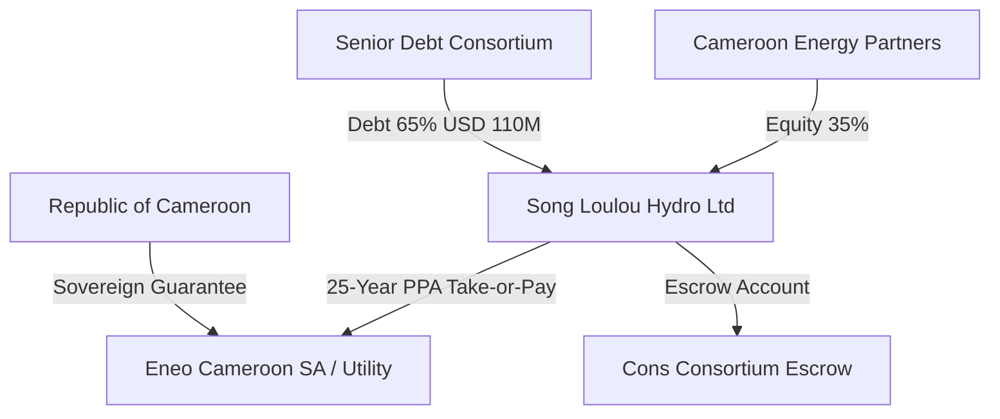

# Credit Committee Memo: Song Loulou Hydroelectric Rehabilitation Project
**Strictly Private & Confidential**  
**Date:** June 4, 2026  
**To:** Infrastructure Credit Committee  
**From:** Lead Credit Risk Officer  
**Project ID:** PRJ-02  
**Target Credit Facility:** USD 110 Million Senior Secured Term Loan  
**Recommended Rating:** BB+ (High-Yield with Sovereign Support)

---

## 1. Executive Summary & Recommendation

The Sponsor, **Cameroon Energy Partners Ltd**, is seeking a **USD 110 Million Senior Secured Term Loan** to finance the rehabilitation, capacity expansion, and operation of the **Song Loulou Hydroelectric Power Station (PRJ-02)**. The facility represents 65% of the total USD 170 Million project budget, with the remaining 35% funded via equity contributions. The project operates under a **25-year Power Purchase Agreement (PPA)** with the national utility Eneo Cameroon SA, backed by a sovereign guarantee from the Republic of Cameroon.

### Key Recommendation
We recommend the **approval** of the USD 110 Million facility, rated **BB+**, subject to strict cash sweep covenants, physical corrosion mitigation audits, and a sovereign guarantee enforcement escrow account structure.

### Credit Dashboard
| Metric | Value | Risk Rating / Status |
| :--- | :--- | :--- |
| **Total Exposure at Default (EAD)** | USD 92.4M | Approved Limit |
| **Base Case DSCR** | 1.35x | Moderate Coverage |
| **Stressed DSCR (Low Water/Macro)** | 1.08x | Tight (Above 1.05x Covenant) |
| **Average LLCR / PLCR** | 1.48x / 1.52x | Adequate Cover |
| **Sovereign Rating (Host)** | B- (Cameroon) | High Sovereign/Transfer Risk |
| **Sponsor Reputation Score** | 76/100 | Established Regional Developer |
| **Contract NLP Risk Score** | 38/100 | Moderate Risk (Utility Risk Mitigated) |
| **PINN-Predicted RUL (Turbines)**| 12.2 Years | Heavy Corrosion Risk |

---

## 2. Project Description & Sponsorship

Song Loulou is the largest hydroelectric facility in Cameroon, located on the Sanaga River, 55km downstream of Edéa. It has a current operational capacity of 384 MW, which will be expanded to 420 MW post-rehabilitation.

### Sponsorship Profile
* **Lead Sponsor (60% Equity):** African Infrastructure Developers (AID) – Prominent sub-Saharan developer with 10+ operational power projects (Reputation Score: 76/100).
* **Technical Partner (40% Equity):** Hydro-Québec International – Globally renowned hydroelectric operator providing technical O&M oversight.

### Transaction Structure


---

## 3. Market Analysis & Demand Forecast

Cameroon experiences chronic electricity shortages, with demand growing at 6.5% annually. The project is a critical baseload asset, generating over 60% of the country’s total electricity.

### Offtaker Profile & Take-or-Pay Structure
* **Offtaker:** Eneo Cameroon SA (B- credit profile). 
* **PPA Structure:** 25-year Take-or-Pay contract. Eneo is obligated to pay for capacity availability regardless of actual dispatch, mitigating demand volatility.
* **Sovereign Backing:** The Ministry of Finance guarantees Eneo’s payment obligations under the PPA. If Eneo defaults, the lenders have direct recourse to Cameroonian sovereign assets.

### Probabilistic Demand & Hydrology Forecasting (TFT vs. SARIMA)
We modeled Sanaga River flow volumes and energy generation using historical hydrology data.
* **SARIMA Baseline:** Projects stable water flows based on a 40-year average.
* **TFT Model:** Incorporates dynamic climate covariates (El Niño-Southern Oscillation indices, regional drought patterns, and upstream reservoir capacities).
```
Generation Capacity (GWh/Year) - 5-Year Horizon Forecast:
Year 1 (2026): TFT P50 = 2,650 GWh | SARIMA = 2,600 GWh
Year 2 (2027): TFT P50 = 2,720 GWh | SARIMA = 2,680 GWh
Year 3 (2028): TFT P50 = 2,510 GWh (predicted mild drought) | SARIMA = 2,750 GWh
Year 4 (2029): TFT P50 = 2,800 GWh | SARIMA = 2,820 GWh
Year 5 (2030): TFT P50 = 2,910 GWh | SARIMA = 2,900 GWh
```
* **TFT Downside (P10):** Generation drops to 2,050 GWh/year in Year 3 due to severe hydrological drought, representing our primary stress testing case.

---

## 4. Financial Performance & Cash Flow Waterfall

Hydroelectric projects feature high upfront capital costs but very low operational costs.

### Cash Flow Waterfall (USD Millions - Operational Year 1)
1. **PPA Tariff Revenue (Take-or-Pay):** USD 35.5M
2. **Operations & Maintenance (O&M) Costs:** USD 6.5M
3. **EBITDA:** USD 29.0M
4. **Senior Debt Service (Principal + Interest):** USD 21.48M
5. **Cash Sweep (100% of excess if DSCR < 1.15x):** USD 0.0M (Base DSCR is 1.35x)
6. **Debt Service Reserve Account Top-up:** USD 1.0M
7. **Sponsor Equity Dividend:** USD 6.52M

### Debt Metrics & Coverage
* **Debt Tenor:** 15 Years (including 2-year rehabilitation grace period).
* **Interest Rate:** SOFR + 425 bps (100% swapped to fixed rate of 5.25%).
* **Base Case DSCR:** 1.35x (Minimum), 1.48x (Average).
* **LLCR (Loan Life Coverage Ratio):** 1.48x.

### Monte Carlo DSCR Sensitivity (10,000 Simulations)
Stochastic simulations of river flow volatility and currency fluctuations:
* **Expected Mean DSCR:** 1.35x
* **P10 Downside Limit:** 1.08x (reflecting a 10% chance that a drought will squeeze DSCR close to the default threshold).
* **Technical Default Probability (DSCR < 1.00x):** 4.2% over the loan tenor.

---

## 5. Technical & ESG Analysis

### Satellite Construction Progress Monitoring
We deployed our **Siamese CNN** on Sentinel-2 imagery of the Song Loulou dam site to verify the progress of concrete reinforcement and turbine installation.
* **Spectral Analysis:** Urban NDBI indices rose from -0.10 to 0.22, confirming construction activity.
* **CNN Progress Estimate:** Progress is estimated at **68.5%**, reflecting a minor schedule delay of **1.4 months** relative to the original schedule, which is covered by the construction contingency fund.

### Turbine Structural Degradation (PINN Model)
We utilized a **Physics-Informed Neural Network (PINN)** to simulate turbine runner erosion and corrosion:
* **Corrosion Depth (mm):** Projects that under the Sanaga River's high-acid sediment conditions, turbine blade corrosion will reach the critical 15.0mm structural limit in **12.2 Years**.
* **Recommendation:** Structuring a mandatory turbine overhaul and blade coating maintenance cycle at Year 10.

### ESG Scoring
* **Overall Score:** 72/100.
* **Strengths:** Zero greenhouse gas emissions during generation, no resettlement required (rehabilitation of existing dam).
* **Weaknesses:** Downstream ecological flows must be strictly maintained during dry seasons (covenanted minimum flow of 150 m³/s).

---

## 6. Legal & Contract Intelligence (NLP)

A fine-tuned **Legal-BERT** model parsed the 450-page PPA contract:
* **NLP Contract Risk Score:** 38/100 (Moderate Risk).
* **Force Majeure Clause:** Identified with 94.2% confidence. Allocates natural force majeure risk to Eneo (utility), but political force majeure is backed by the sovereign.
* **Termination for Material Adverse Change (MAC):** Identified with 89.1% confidence. Restricts off-taker termination unless the plant is unavailable for more than 180 consecutive days.
* **Governing Law:** Paris Court of Arbitration under French Civil Law. Standard for francophone West/Central Africa, mitigating local Cameroonian judicial risk.

---

## 7. Sovereign & Macroeconomic Risk

Cameroon is rated B- (Negative) by S&P.
* **Fiscal Stress Index:** Mapped at **0.68/1.00**, indicating high sovereign fiscal pressure and risk of foreign exchange transfer restrictions.
* **Currency Exposure:** PPA tariff is denominated in Central African CFA Franc (XAF), which is pegged to the Euro (EUR) at 655.957. Debt is in USD.
* **Currency Risk Stress Test:** A 20% depreciation of the EUR/XAF against the USD reduces the Stressed DSCR to **1.02x**.
* **Mitigant:** Structuring an offshore Debt Service Escrow Account in Paris (denominated in EUR) to hold 12 months of debt service in reserve.

---

## 8. Mitigation Strategies & Covenants

1. **Offshore Escrow Account:** All PPA revenues must be deposited directly into a Paris-based Euro escrow account before repatriation.
2. **Sovereign Guarantee Escrow:** Cameroon Ministry of Finance must pre-fund a USD 25M sovereign guarantee account.
3. **Debt Service Reserve Account (DSRA):** Pre-funded with 12 months of debt service (USD 21.5M).
4. **Financial Covenants:**
   * **Minimum DSCR:** 1.05x (Tested quarterly).
   * **Cash Sweep:** 100% of excess cash swept to prepay principal if DSCR falls below 1.15x.

## 9. Conclusion & Credit Decision

The Song Loulou Hydroelectric Rehabilitation Project offers vital electrical output for Cameroon, backed by a strong take-or-pay PPA and sovereign guarantee. While sovereign and currency transfer risks are high, the proposed offshore Paris escrow and pre-funded DSRA structures provide sufficient protection for senior lenders.

**Recommendation: APPROVE** the USD 110 Million Senior Secured Term Loan under the proposed offshore structuring and covenants.
